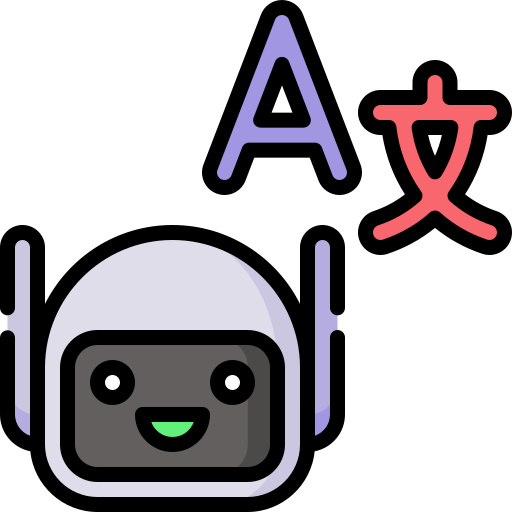

<a href="https://www.flaticon.com/free-icon/translation_13481633" target="_blank">
   </img>
</a>

# Translation Service

[](https://opensource.org/licenses/MIT)
[](https://www.python.org/downloads/release/python-3137/)
[](https://github.com/belav/csharpier)


A lightweight C# translation microservice powered by [neural machine translation](https://en.wikipedia.org/wiki/Neural_machine_translation) (NMT) via [LibreTranslate](https://github.com/LibreTranslate/LibreTranslate). The service has two endpoints, one for a single-key value translation (`POST /translate`) and one for batch translation (`POST /translate-bulk`).


<p align="center">

<p align="center">
    <label><b>Fig. 1</b>: System overview</label>
    </p>
</p>

## Quick Start

```bash
cd translator
docker compose up --build
```

## Example usage

1. Translating exactly one key/value pair. (`POST /translate`)

```
{
  "target": "fr",
  "data": {
    "key-1": "Hello world"
  }
}
```

And the response would be:

```
{
  "key-1": "Bonjour le monde"
}
```

2. Translating multiple key/value pairs. (`POST /translate-bulk`)

```
{
  "target": "fr",
  "data": {
    "key-1": "Hello world",
    "key-2": "This is a simple description.",
    "key-3": "Simple text"
  }
}
```